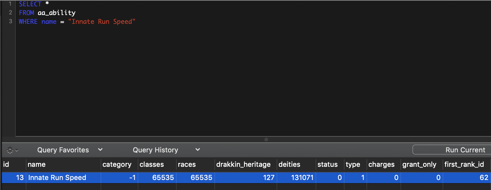
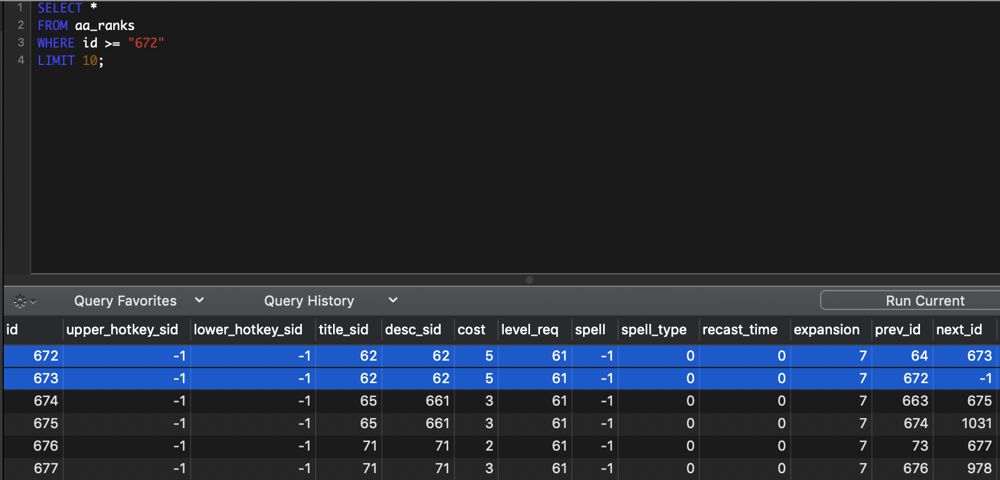
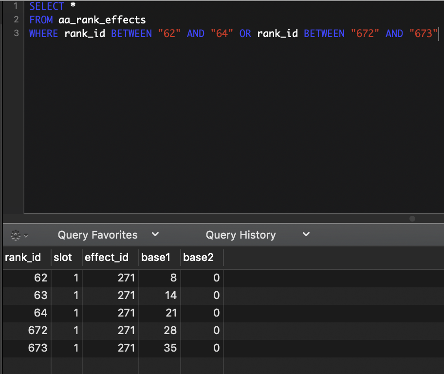

# Customizing AAs

## What are Alternate Advancements?

The Alternative Advancement system was introduced during the Luclin expansion of EverQuest.  AAs were gained by contributing some portion of gained experience to the AA experience pool, diverting experience from the standard leveling experience pool.

By default, when a player reaches level 51, the player unlocks the option to dedicate experience to Alternate Advancements. AAs are accessed inside Everquest using the default "v" hotkey. 

## "Ranks" in Alternative Advancements

AAs often have "ranks" available that allow you to progress the ability, making the effects more powerful at each rank level purchased.  These values are stored in the [aa_rank](https://eqemu.gitbook.io/database-schema/categories/aas/aa_ranks) table. For example, _Innate Run Speed_ has many ranks to represent the levels it can be trained. 



Notice the field `first_rank_id`.  This field allows us to then explore the AA ability to find out additional parameters:


Notice the two columns for previous and next rank id.  At the first rank of Innate Run Speed, we know there are no earlier ranks, so the `prev_id` field reads **-1.  **The next rank ID is then **63**, which then goes to **64**, and then goes to **672**.  Notice that these rank IDs are not always consecutive.  Obviously we can infer that Innate Run Speed has _at least_ four ranks, since our next ID takes us to 672--if the AA stopped at the third rank, we would have instead seen a **-1** value.

Let's take a look at rank ID 672 and find out how far this goes...



Note again the `prev_id` and `next_id` column values.  We remember from the previous step that we left off at ID **64**, and see that the next ID is **673**. We see at ID 673 that we finally reach the end, indicated by the **-1** value in the `next_id` column.  

Now we know:  there are five ranks of _Innate Run Speed_ in the PEQ Database as of this writing.  

In order to find out what the advantage of _Innate Run Speed 3_ compared to _Innate Run Speed 2_, we will have to take a look at the effects of each rank.

## Rank Effects in Alternative Advancements

The effects of each rank of an AA is stored in the aptly named [aa_rank_effects](https://eqemu.gitbook.io/database-schema/categories/aas/aa_rank_effects) database table.  

Let's examine the rank effects for our _Innate Run Speed_ AA:



We see that at all ranks, the spell effect in use is 271, and we see that the base1 value increases at each rank.


If you haven't read up on Spells for your EQEmu Server, you might want to take a quick look at the [Spells Guide](../spells/) before continuing.


271 is SE_BaseMovementSpeed and BV of the effect is percent.  While SE 271 does not have limit or max value, it unfortunately does not stack with other movement increases.  To summarize in a table, here is each rank of _Innate Run Speed_:

| Rank | Increase To Movement Speed |
| ---- | -------------------------- |
| 1    | 8%                         |
| 2    | 14%                        |
| 3    | 21%                        |
| 4    | 28%                        |
| 5    | 35%                        |

If you're thinking what I'm thinking, we could definitely take over the world by adding several more ranks to _Innate Run Speed_--we already know that SE 271 does not have a max! 

## Add a new Rank

Start by adding another AA Rank:

```sql
INSERT INTO aa_ranks (`id`, `upper_hotkey_sid`, `lower_hotkey_sid`, `title_sid`, `desc_sid`, `cost`, `level_req`, `spell`, `spell_type`, `recast_time`, `expansion`, `prev_id`, `next_id`)
VALUES
	(NULL, -1, -1, 62, 62, 1, 51, -1, 0, 0, 3, 673, -1);
```

Using the NULL value will cause the Auto-Increment feature to work for us, and provide the next available ID for our new rank.  Don't forget that we need to tell the original highest rank of _Innate Run Speed_ (673) that it now has a new rank.  How do we find out what ID auto-increment just chose?  We can make use of SQL's `LAST_INSERT_ID()` function:

```sql
SELECT LAST_INSERT_ID(); -- Returns the id INT value
```

Since you may have customized your server, I will leave this value  set using this function through the rest of the guide.  It's important that you keep track, however, as your insert ID may change!  You can now run a query to change the existing "**-1**" `next_id` value to the latest ID:

```sql
UPDATE aa_ranks 
SET next_id = LAST_INSERT_ID()
WHERE rank_id = "673"
```

That should be it--we have created a new rank!  Now let's assign our rank effect to scale up _Innate Run Speed 6._

## Add a New Rank Effect

We'll want to assign the next AA Rank Effect to our new rank of _Innate Run Speed_.

```sql
INSERT INTO `aa_rank_effects` (`rank_id`, `slot`, `effect_id`, `base1`, `base2`)
VALUES
	(LAST_INSERT_ID(), 1, 271, 42, 0);
```

And now we have finished adding _Innate Run Speed 6_, which provides a movement speed increase of 42 percent!  

## Commands Related to AAs

| Command            | Description                                                        |
| ------------------ | ------------------------------------------------------------------ |
| #reloadaa          | loads changes to the DB to the world                               |
| #resetaa           | Requires a player target, resets their AAs and refunds the points  |
| #resetaa_timer     | Resets your target's AA timers so that AAs can be used immediately |
| #setaapts [value] | Set your target's available AA points                              |
| #setaaxp [value]  | Set your target's AA experience                                    |
