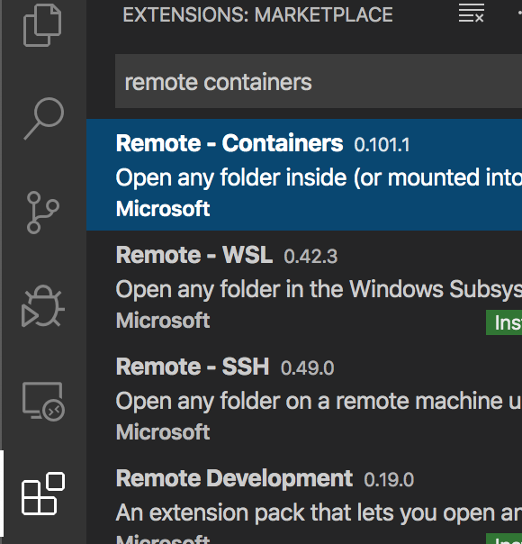
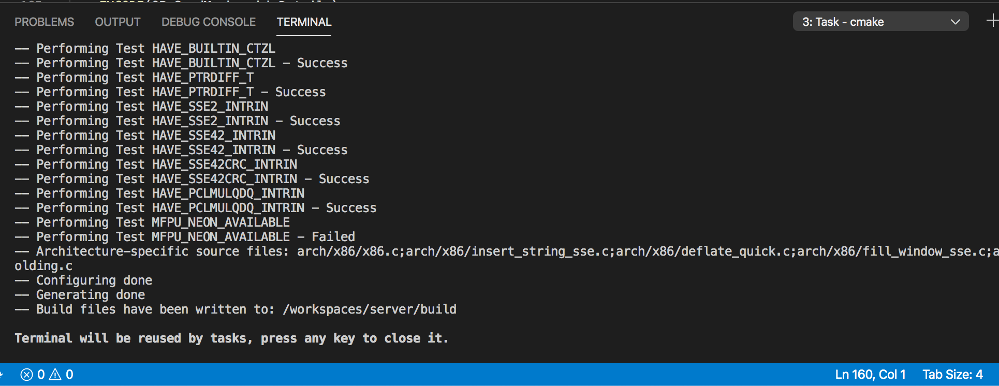

# VSCode Dev Container Environment

Requires: Docker, VSCode

VSCode can be found at: [https://code.visualstudio.com/](https://code.visualstudio.com)

If on Mac or Windows, you can install [https://www.docker.com/products/docker-desktop](https://www.docker.com/products/docker-desktop)

!!! info
    Docker for Windows requires Windows 10 Pro 64bit or better [https://docs.docker.com/docker-for-windows/install/#what-to-know-before-you-install](https://docs.docker.com/docker-for-windows/install/#what-to-know-before-you-install)

Either fork or clone the [eqemu server repo](https://github.com/EQEmu/Server) (**Be sure to include submodules!**)

```
$ git clone --recurse-submodules git@github.com:EQEmu/Server.git server
$ cd server
$ code .
```

!!! info
    If `code` is not a recognized command, you can alternatively Open Visual Studio Code manually, and drag-drop the Server folder into the window.

## Prepare extensions

Once VSCode is open with the project, you will be prompted:


Click install on this prompt. (You might get this prompt again while in the Dev Container environment)

Next, if not already installed, go into your extensions and search for **remote containers**



Once extension is finished installing, This prompt should pop up on the bottom left area. (Some times, click the bell icon on bottom right of the VS Code window to get this prompt)


After clicking Reopen in Container,  you will be waiting a while for the first image build, as the environment is set up. You can click the (**details**) link if curious what the process is doing. The Dockerfile being generated can be found in the .dev-containers/Dockerfile directory.

Once the build is complete, click **Terminal, Run Build Task **on the top menu of VS Code. After a moment, an option list of **cmake** or **make** will appear. First, run **cmake.**

cmake will open a pane on the bottom half of your screen with the task being ran, and any errors it has will appear will display on the last line



Next, run **Terminal, Run Build Task** again, and this time choose **make**


The first build will take a while. Once you have everything built, the additional runs will be much faster. Note that the output binaries are being generated in the **build/bin/** directory of the repository.

Once the make build task command finishes, open any .cpp file to trigger the building of intellisense.
