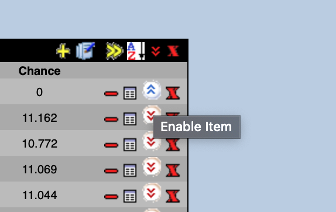
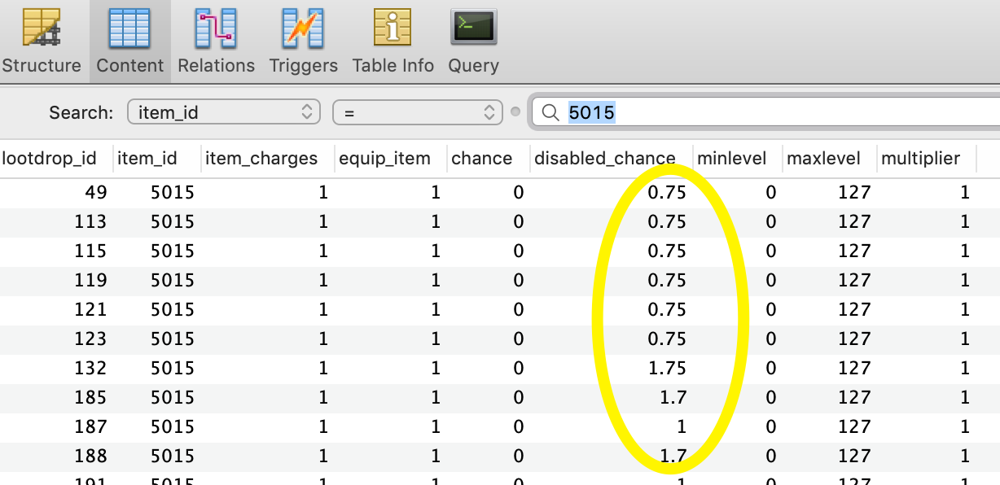
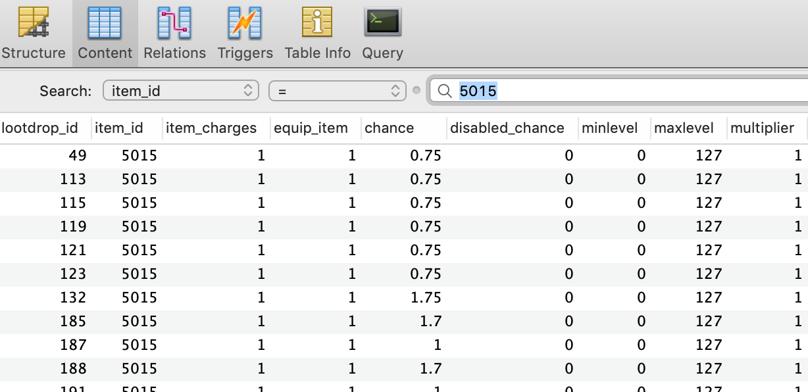

# Disabling Lootdrop Entries

Did you know that you can disable lootdrop entries in a way that allows you to restore them later?  This overlooked feature will allow you to turn off certain lootdrop entries--perhaps those that are out of era for your server, and easily turn them back on later.


A "disabled" loot drop entry simply means that the item will no longer have the possibility of dropping when the NPC is killed.


### Using PEQ Database Editor


In the PEQ Database editor, you'll notice that there is a button with two red arrows pointing downward.  This button allows you to disable a lootdrop entry.


Once you click the button, the lootdrop entry is then disabled, and the icon changes to two blue arrows pointing upwards.  Clicking the arrow again toggles the state and the item is once again enabled for dropping.  


Note that the chance goes to '0' when disabled, and returns to its previous value once re-enabled.  We used this functionality to **preserve the original value** in case we want to **retrieve it later**.




How does this work?  Is it magic?  The function becomes apparent if you utilize an sql query to achieve the same results.  

### Using an SQL Query

If you wanted to globally disable an item from dropping, you can also use an sql query.  This may be quite a bit more efficient than visiting each and every lootdrop table utilizing the PEQ Database editor.

For this example, we will disable all lootdrop entries for item ID 5015 - Rusty Scythe, using an sql query.  The purpose of this query is to make use of a field in the lootdrop_entries table called 'disabled_chance', which will store the original drop chance value until we choose to enable it again.

First, let's take a look at our database to see the item listed in its corresponding lootdrop_entries.  Notice the "chance" column, which is used to set the probability of the item dropping when the NPC is killed.


As of this writing, there are 161 lootdrop_entries containing a 5015 - Rusty Scythe.  If we want to turn off drops of this item, but do so in a manner that allows us to restore them later, we can run the following query:

```sql
UPDATE lootdrop_entries
SET disabled_chance = chance, chance = 0
WHERE item_id = 5015
```

The result is that the normal drop chance is moved into the disabled chance field, allowing us to retrieve it later, should we decide to re-enable drops.  Notice that all the values simply move to the adjacent field.



Since the "chance" of the Rusty Scythe dropping has been reduced to 0, we will no longer have to endure those bothersome drops.  The Disabled Chance field does nothing--it is simply a placeholder for the old drop chance value.

If we would like to enable Rusty Scythes to drop again, we would have to reverse the order of our query:

```sql
UPDATE lootdrop_entries
SET chance = disabled_chance, disabled_chance = 0
WHERE item_id = 5015
```

And we can then see that we have restored the values we moved to our disabled_chance field, once again allowing the Rusty Scythe to drop in our world:



That's all there is to it!  Enjoy a world free from those unwanted loots, and a clever method to disable loots in a non-destructive manner.

## Advanced Topic

It's possible that you may find yourself in a situation where you would like to disable lootdrop entries from individual NPCs and move them to a global loottable.  For instance, if you do not want to have hundreds of loottables containing trade skill items, you could easily disable the lootdrop entries using the method above and then add those items to a global loottable.

But what if you had already added items to a global loottable and you wanted to disable all of the individual lootdrops entries?  It can be done:

```sql
-- Disable all lootdrop entries EXCEPT global loot entries
UPDATE lootdrop_entries AS lde
INNER JOIN loottable_entries AS le
	ON lde.lootdrop_id = le.lootdrop_id
INNER JOIN global_loot AS gl
	ON le.loottable_id = gl.loottable_id
SET lde.disabled_chance = lde.chance, lde.chance = 0
	WHERE lde.item_id = 1234567
		AND gl.enabled != 1
```

Since the `global_loot` table has a field `loottable_id`, we make a join with the `loottable_entries` table on the matching `loottable_id` field, and join the `loottable_entries` table with the `lootdrop_entries` table on the `lootdrop_id` field.

As before, we simply specify our item id (listed as "1234567" in the example above) in the `WHERE` clause, and presume that the global loot entry is enabled to make our match.  

If you're considering moving items like tradeskill items to a global loottable, it is probably best to disable their lootdrop entries first, and keep track of your changes, and then add them to a global loottable.  

