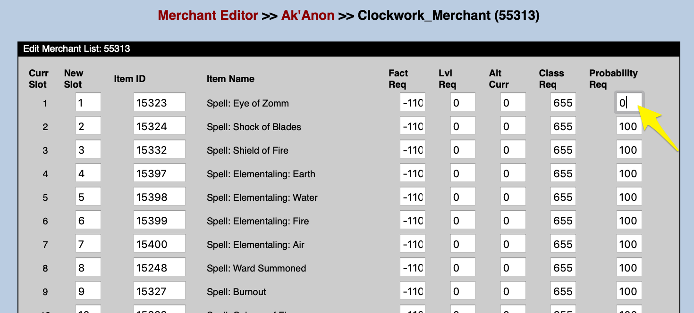
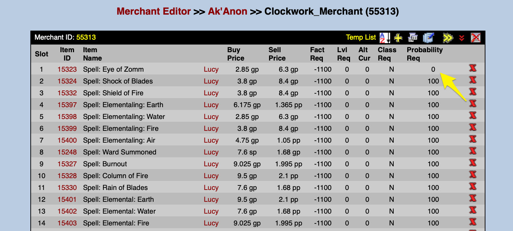

# Disabling Merchantlist Entries

Did you know that you can disable merchantlist entries in a way that allows you to restore them later?  Most merchantlist entries have a probability of 100--meaning that the merchant will always have the item (there are very few exceptions).  

If you would like to disable any particular item from the merchant's inventory, perhaps those that are out of era for your server, and easily turn them back on later, follow the steps below.

### Using PEQ Database Editor

Navigate to the Loot tab in PEQ Database Editor, select the Zone and the Merchant in which you are interested.  You will see a listing of the merchant's wares:


Note the field that shows Probability Req--this is the probability that the merchant will have the item.  To Edit this field, select the "Edit this Merchant" button, which looks like a stack of papers:


Once you're in edit mode, you can change the probability to '0' to indicate that there's NO chance this merchant will stock the item.



Once you've made your changes, scroll down and click the "Submit Changes" button.  There is now no chance that the merchant will stock the item.  You can easily re-enable the item at a later time by returning the probability required field to 100 percent.



The advantage of this method of disabling items available on a merchant is that you can turn them off and on without deleting the record permanently.  If you delete the item altogether, if you choose to add it again later, you will have to input the ID, buy price, sell price, faction, etc. so that the merchant can once again sell the item.

!!! info
      If you want to see this change in-game immediately, you can use the command **#reloadmerchants**, which is documented on the [Loading Server Data](../../../../categories/how-to-guides/operation/loading-server-data) page.


### Using an SQL Query

You can also easily disable merchantlist entries globally by using an sql query.  Since the probability that a merchant will have an item is typically 100 percent, you can utilize a query for any item ID to set the probability to 0--disabling the item from being sold.

If we want to see how many merchantlist entries contain item ID 15323 - Spell: Eye of Zomm, we can simply filter (query) the merchanlist entries for this item by ID.


To disable this item so that merchants no longer keep it in stock, while preserving the entry in the merchantlist, we issue a simple query:

```sql
UPDATE `merchantlist`
SET probability = 0
WHERE item = 15323
```

The result is that the probability of the item being in stock is now 0, and players will no longer find this item for sale in our world:


!!! info
      If you want to see this change in-game immediately, you can use the command **#reloadmerchants**, which is documented on the [Loading Server Data](../../../../categories/how-to-guides/operation/loading-server-data) page.


To re-enable the item, a simple query can be used to reverse our change:

```sql
UPDATE `merchantlist`
SET probability = 100
WHERE item = 15323
```

That's all there is to it!  Enjoy a world free from those unwanted merchantlist entries, and a clever method to disable them in a non-destructive manner.

