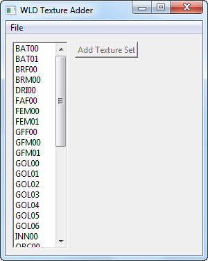
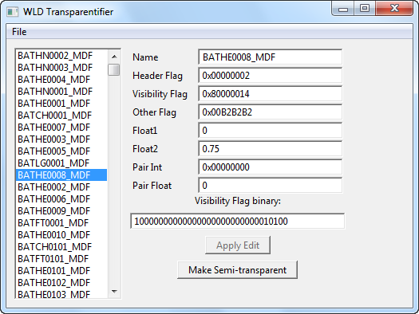

# WLD Editor Suite

This is a suite of tools for manipulation of WLD files created by [Zaela](https://github.com/Zaela) with some (plagiarized} instructions describing their use.

## Download


7zip file containing WLD Editor Suite


## Texture Adder

Texture Adder is a tool for adding new texture set data, allowing you to add custom mob model textures under new IDs rather than overwriting old ones.

#### Instructions

1. Pick your desired _chr.s3d file and make a backup copy of it.
2. Extract the internal .wld file using S3DSpy.
3. Run Texture Adder and select the .wld file from File > Load WLD. This will produce a list of model texture sets, like so:  



4. Select a model texture set from the list.

5. Hit the "Add Texture Set" button. The texture set data entries for your current selection will be copied, and the newly copied data will be renamed under the next available ID. For example, if we selected FEM01 from the above list and copied it, we'd end up with a new entry for FEM with ID 02.

6. Using S3DSpy, note all the textures belonging to the model and ID you copied, e.g. FEMCH0101.bmp, FEMCH0102.bmp, FEMLG0101.bmp, etc, where the format is MDL**ID**.bmp. Create your new textures based on these and give them the new ID, e.g. FEMCH0201.bmp, FEMCH0202.bmp, FEMLG0201.bmp, etc.

7. Insert the your new textures and the edited .wld file into the _chr.s3d file using S3DSpy.

8. Voila!


Note that the texture set data in the .wld file is different from the texture files that go into the .s3d. Other than the visibility/transparency settings (and some unknowns, see below), they basically just tell the client "a texture with this name exists, and you should try to load it for this model and ID".


## Transparentifier

Transparentifier is a tool for editing texture visibility flags, allowing you to e.g. tell the client to render arbitrary textures as semi-transparent, turn full transparency masking on/off, etc.

#### Instructions

1. Pick your desired _chr.s3d file and make a backup copy of it.
2. Extract the internal .wld file using S3DSpy.
3. Run Transparentifier and select the .wld file from File > Load WLD. This will produce a list of texture data, like so:




The names should line up with the names of .bmp files in the .s3d. Most of the data fields on the right have unknown functions (and are presented just in case anyone might want to try to figure someting out by looking for patterns), but the one we're interested in is the "Visibility Flag". Typical textures have values like 0x80000013 or 0x80000014. The "Visibility Flag binary" field represents the same value, but in binary (obviously). This field can be edited; each of the ones and zeros potentially corresponds to one setting being turned on or off for that texture. Which bits do what has not been thoroughly tested, but the user is free to experiment. On the other hand, if you just want to make something semi-transparent, a button is provided to do just that. Note that the button is not very smart -- it justs pastes 0x80000017 over the current value rather than setting specific bits (I'm too lazy to puzzle out exactly which bits are needed just yet). This should work fine for textures that have values of 0x80000013 or 0x80000014 beforehand, but may cause crashes on others.

5. When you've changed what you want, insert the .wld file back into the .s3d file using S3DSpy..
6. Done!

## Weapon Copier

The Weapon Copier is a tool for copying (old) weapon models and textures under new IDs of your choosing, to allow alternate skins etc.

#### Instructions

The instructions for Weapon Copier are pretty much the same as for Texture Adder, the main difference being that you get to input the new ID number you want your copy to have. (It's up to you to make sure you use a free ID.) Also, because the names of textures items use are not necessarily as consistent as for mob models, when you make a copy a .txt file will be made detailing the source texture files and the new names they will be expected under. For example:

```
it335_info.txt
IT174BLADE.BMP -> IT335BLADE.BMP
IT174METAL.BMP -> IT335METAL.BMP
IT174HANDLE.BMP -> IT335HANDLE.BMP
IT174GEM.BMP -> IT335GEM.BMP
```

## Particle Editor

The Particle Editor is an editor for particle data for .s3d-based weapon particles. Most fields are unknowns, but I managed to find the ones for particle lifetime, delay between emissions, and how many of the same particle can be alive at once. Which is enough to make old weapons pump out absurd amounts of particles. With some trial and error and observation of a certain flag one can also change whether the particles stick around a weapon as it swings (animating strictly in weapon-space) or trailing behind it as it moves (animating in world-space around the point at which they were emitted).
