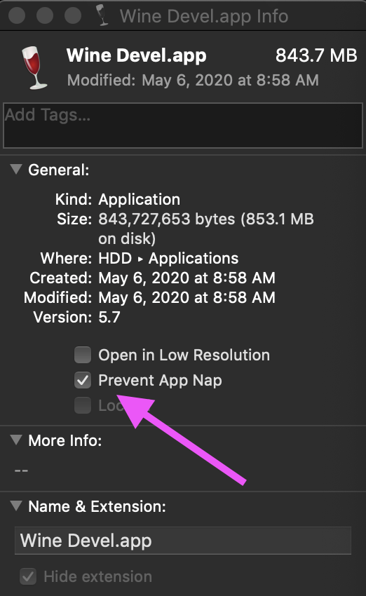
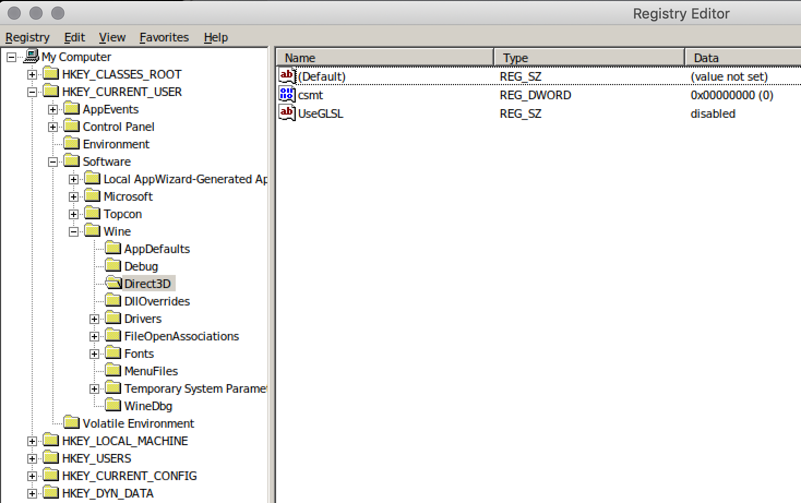

# macOS Client Configuration

The EverQuest client can be run through Wine v4 (old) or v5 (current) on macOS Mojave. A similar workflow should work for older versions of macOS.  

!!! danger
    You **cannot** use a case-sensitive drive formatting schema.

!!! warning
    If you are running Catalina, you will **not** be able to run EverQuest at this time. 

If you wish to downgrade Catalina to Mojave, you will be in for an adventure.  It can be accomplished, but is well-beyond the scope of this guide.

!!! info
    With the introduction of macOS Mavericks, "App Nap" was introduced.  You will likely want to turn this off (instructions below).

**To configure your system, follow these steps:**

## Install Xcode:

* Click the Apple Icon in the upper-left corner of your screen⋅⋅
* Choose App Store...
* Search for Xcode
* Install Xcode

### Install Command Line Tools:

* Open Terminal (_/Applications/Utilities/Terminal.app_)
* Copy and paste this command and execute:

```text
xcode-select --install
```

## Install Homebrew:

* Copy and paste this command and execute:

```text
/usr/bin/ruby -e "$(curl -fsSL https://raw.githubusercontent.com/Homebrew/install/master/install)"
```

### Create a symbolic link between X11 folders:

* Copy and paste this command and execute:

```text
sudo ln -s /opt/X11 /usr/X11
```

## Install XQuartz:

* In Terminal... (_/Applications/Utilities/Terminal.app_)
* Copy and paste this command and execute:

```text
brew install Caskroom/cask/xquartz
```

### Create a symbolic link between library folders:

* Copy and paste this command and execute:

```text
sudo ln -s /usr/local/lib /usr/X11/lib/*
```

## Install Wine

!!! info
    This step has recently been updated due to changes with Wine.

* In Terminal... (_/Applications/Utilities/Terminal.app_)
* Copy and paste this command and execute:

```text
brew install cask wine-stable
```

### Create a 32-bit Wine Prefix

!!! info
    Unfortunately, wine-stable now installs a 64-bit Prefix.  Be sure to complete this step to overcome this unfortunate decision.

* Copy and paste this command and execute:

```text
WINEARCH=win32 WINEPREFIX=~/.wine winecfg
```

### Install Winetricks

* Copy and paste this command and execute:

```text
brew install winetricks
```

### Configure Wine fonts

* Copy and paste this command and execute:

```text
winetricks corefonts
```

### Configure Font Smoothing

* Copy and paste this command and execute:

```text
cat << EOF > /tmp/fontsmoothing
REGEDIT4

[HKEY_CURRENT_USER\Control Panel\Desktop]
"FontSmoothing"="2"
"FontSmoothingOrientation"=dword:00000001
"FontSmoothingType"=dword:00000002
"FontSmoothingGamma"=dword:00000578
EOF

WINE=${WINE:-wine} WINEPREFIX=${WINEPREFIX:-$HOME/.wine} $WINE regedit /tmp/fontsmoothing 2> /dev/null
```

## Launch EverQuest

!!! info
      Be sure to follow the instructions to [configure your client](../../../../server/how-to-guides/client-configuration#all-operating-systems) for use with EQEmu that are applicable to all operating systems.


* In Terminal... (_/Applications/Utilities/Terminal.app_)
* Navigate to your EverQuest directory (IE _cd Applications/EverQuest/_)
* Launch with the "patchme" option:

```text
wine eqgame.exe patchme
```

## Optional Launcher Script/Icon

* Open TextEdit (_/Applications/TextEdit.app_)
* Copy and paste the information below
* Replace $WINEPREFIX with the location of your Prefix
* Replace the path to your EverQuest folder
* Save the file as "EverQuest.command"

```text
#!/bin/bash
export WINEPREFIX="$WINEPREFIX/.wine"
export DYLD_FALLBACK_LIBRARY_PATH=/usr/X11/lib
export FREETYPE_PROPERTIES="truetype:interpreter-version=35"
cd "/path/to/my/everquest/folder/"
wine eqgame.exe patchme
```

## Troubleshooting

### Client Disconnects When Inactive

Mac OS Mavericks introduced a power-saving feature called "App Nap" to save battery power on apps that are not actively being used.  When Wine is put into "nap" mode, you will likely be disconnected from the world server.

#### Steps to disable "App Nap"

1. Open the **Finder** App and navigate to your _Applications_ folder
2. Right-click on your **Wine** application
3. Choose the _Get Info_ option on the contextual menu
4. Check the box that says _Prevent App Nap_



### Excessive GPU usage with MacOS Mojave

* Open Terminal (_/Applications/Utilities/Terminal.app_)
* Enter the command "wine regedit"
* HKEY_CURRENT_USER -&gt; Software -&gt; Wine -&gt; Direct3D
* Create a DWORD Value (REG_DWORD) named "[csmt](https://wiki.archlinux.org/index.php/wine#CSMT)" and set the value to 0x0 (disable)

!!! info
      If you do not find Direct3D in Wine, locate your installation and make the same modification.




